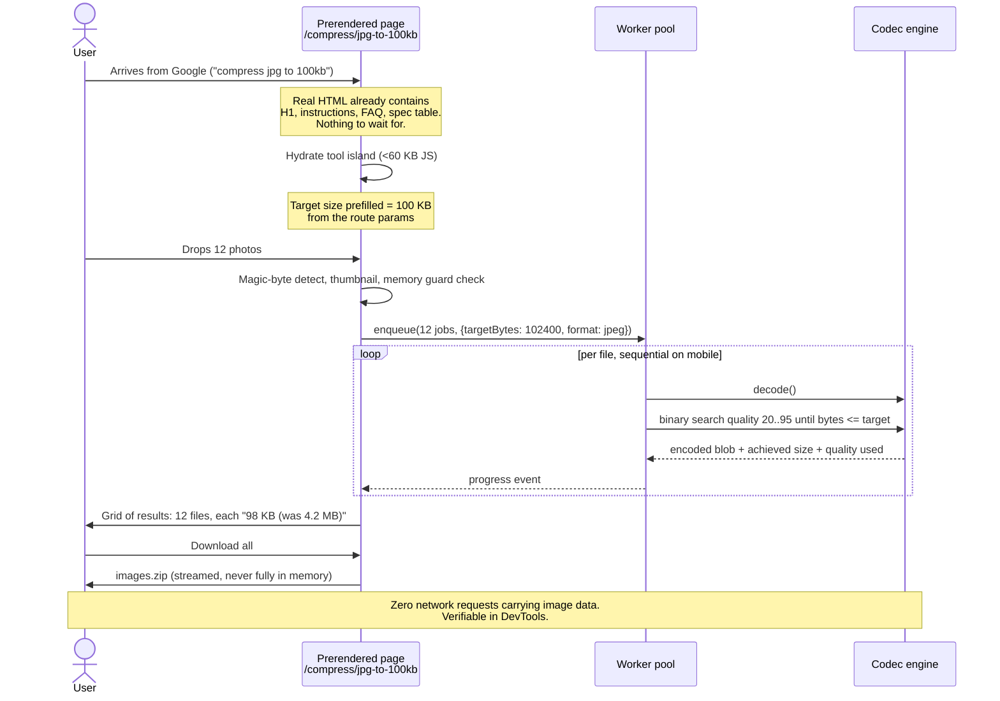
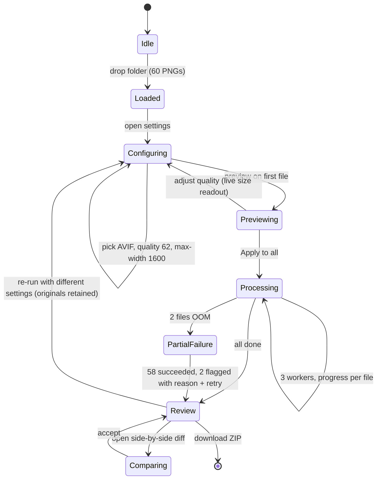

# 03 — Feature Map

---

## 1. Capability tree

```mermaid
graph TD
    A[KeptPix] --> B[Ingest]
    A --> C[Transform]
    A --> D[Deliver]
    A --> E[Platform]

    B --> B1[File picker / multi-select]
    B --> B2[Drag & drop incl. folders]
    B --> B3[Clipboard paste]
    B --> B4[Format sniffing by magic bytes]
    B --> B5[Metadata inspection pre-process]

    C --> C1[Decode]
    C --> C2[Resize / crop]
    C --> C3[Encode]
    C --> C4[Target-size search]
    C --> C5[Metadata strip / preserve]

    C1 --> C1a[Canvas-native: JPEG PNG WebP GIF BMP]
    C1 --> C1b[WASM: HEIC AVIF TIFF JXL]
    C1 --> C1c[SVG rasterize]

    C3 --> C3a[Canvas-native: JPEG PNG WebP AVIF*]
    C3 --> C3b[WASM: mozjpeg oxipng avif jxl]

    D --> D1[Single download]
    D --> D2[ZIP batch download]
    D --> D3[Copy to clipboard]
    D --> D4[Save-in-place via File System Access]

    E --> E1[Prerendered SEO routes]
    E --> E2[PWA / offline]
    E --> E3[Settings persistence]
    E --> E4[Theme + i18n]
```

`*` AVIF canvas encoding is feature-detected; falls back to WASM.

---

## 2. MoSCoW matrix

### MUST — v1.0 cannot ship without these

| ID | Feature | Module | Notes |
|---|---|---|---|
| M-01 | Drag-drop + file picker, multi-file | `components/react/Dropzone.tsx` | Folder drop via `webkitGetAsEntry` |
| M-02 | Magic-byte format detection | `core/detect.ts` | Never trust the extension |
| M-03 | Decode JPEG, PNG, WebP, GIF, BMP via canvas | `engines/canvas/decoder.ts` | Zero WASM cost |
| M-04 | Decode HEIC/HEIF | `engines/wasm/heif.ts` | libheif, lazy-loaded |
| M-05 | Encode JPEG, PNG, WebP | `engines/canvas/encoder.ts` | `OffscreenCanvas.convertToBlob` |
| M-06 | Quality slider with live output-size readout | `components/react/QualityControl.tsx` | Debounced re-encode |
| M-07 | **Target-size mode (binary search on quality)** | `core/target-size.ts` | The wedge feature |
| M-08 | Resize by px / % / max-fit | `core/resize.ts` | High-quality downscale (stepped) |
| M-09 | EXIF strip on output (default ON) | `core/metadata.ts` | Canvas encode strips implicitly; verify |
| M-10 | Batch queue with per-file status | `state/queue.ts` (`QueueController`) + `workers/pool.ts` | Sequential on mobile, ≤3 concurrent desktop |
| M-11 | Single + ZIP download | `platform/deliver.ts` | `client-zip` streaming, low memory. **Not** `core/` — it needs DOM APIs |
| M-12 | All processing in Web Workers | `workers/*` | Main thread must never block |
| M-13 | Prerendered route per supported format pair | `pages/convert/[pair].astro` | Astro `getStaticPaths` |
| M-14 | Hard memory guard + clear error states | `core/guards.ts` | Prevents the mobile OOM white-screen |
| M-15 | Zero outbound data requests (enforced by test) | `tests/e2e/privacy.spec.ts` | Non-negotiable |
| M-16 | Light/dark, keyboard accessible, AA contrast | `components/react/*`, `styles/tokens.css` | See `08-design-system.md` |
| M-17 | SVG rasterization on decode | `engines/svg.ts` | `Image` + canvas draw at a chosen raster size; needed for the 3 SVG routes |

### SHOULD — targeted for v1.0, but not launch-gate blockers

These all ship inside Milestones 4–8. If Milestone 7 (the verification gate) passes without one of them, v1.0 can still ship and it follows immediately after. Only the MUST list above is a hard gate.

| ID | Feature | Module |
|---|---|---|
| S-01 | Decode + encode AVIF | `engines/wasm/avif.ts` |
| S-02 | Decode + encode **JPEG XL** (rides the Chrome H2-2026 catalyst) | `engines/wasm/jxl.ts` |
| S-03 | mozjpeg encoder for better quality-per-byte than canvas | `engines/wasm/mozjpeg.ts` |
| S-04 | oxipng lossless PNG optimization | `engines/wasm/oxipng.ts` |
| S-05 | Side-by-side original/output visual diff with zoom | `components/react/CompareView.tsx` |
| S-06 | Metadata inspector panel (show EXIF/GPS before processing) | `components/react/MetadataPanel.tsx` |
| S-07 | PWA install + offline shell | `public/manifest.webmanifest`, `public/sw.ts` |
| S-08 | Settings + preset persistence (IndexedDB) | `platform/db.ts` |
| S-09 | Size-preset landing routes (`/compress/jpg-to-100kb`) | `pages/compress/[preset].astro` |
| S-10 | Save-in-place via File System Access API (Chrome desktop) | `platform/deliver.ts` |
| S-11 | Clipboard paste-in and copy-out | `components/react/Dropzone.tsx`, `platform/clipboard.ts` |
| S-12 | TIFF decode | `engines/wasm/tiff.ts` |

### COULD — Phase 3+, only after the core is proven

| ID | Feature | Notes |
|---|---|---|
| C-01 | On-device background removal (RMBG-1.4 via Transformers.js) | Model from R2/HF Hub, not Pages (25 MiB asset cap) |
| C-02 | ID/passport photo maker with per-country crop specs | First paid feature |
| C-03 | Watermark overlay | Text + image, positioned |
| C-04 | PDF → images / images → PDF | Bridges toward the sibling PDF product |
| C-05 | Bulk rename with pattern tokens | Pairs naturally with batch |
| C-06 | Colour-profile handling (ICC preserve/convert) | Photographer audience |
| C-07 | Ed25519 offline license keys + Pro gating | See `06-contracts.md` §4 |
| C-08 | Hindi / Indonesian / Portuguese localization | Follows the traffic geography |

### WON'T — explicitly rejected, do not let scope creep back in

| Feature | Reason |
|---|---|
| Any server-side processing | Violates product principle 1 — the entire thesis |
| User accounts / cloud storage | Requires a backend and a privacy policy we don't want |
| Video conversion in v1 | ffmpeg.wasm is 0.04–0.08× native and memory-bound; would ruin mobile |
| In-browser LLM features | 500 MB download for poor output; not a product |
| Layer-based image editing | Photopea owns it; multi-year build |
| Real-time collaboration | Server-dependent by nature |
| Native iOS/Android apps | PWA covers it; app-store tax and review cycles kill the fast-iteration goal |
| Ads (recommended) | ~$1–5 RPM on tool sites, and a credibility tax on a privacy product |

---

## 3. Primary user journey — Form Filer (the highest-intent path)

**Design intent:** the user's first click after landing is *dropping files*, not configuring anything. The route already knows the target size. Everything else is a default they can override.

---

## 4. Secondary journey — Developer, batch AVIF/WebP

**Design intent:** originals stay in memory (or OPFS) after processing so re-running with different settings is instant and doesn't require re-dropping files. Partial failure must never discard successful results.

---

## 5. Feature → module → milestone map

This table is authoritative and matches `10-build-plan.md` milestone-for-milestone.

| Milestone | Feature IDs | Modules built |
|---|---|---|
| **M0** — Scaffold | — | Tree, tokens, `core/types.ts`, lint boundaries, CI budgets |
| **M1** — Static shell | M-13, M-16 | Astro layouts, static components, `content/formats.ts` seeded with one entry, first `/convert/[pair]` route |
| **M2** — Pure domain | M-02, M-07, M-08, M-14 | `core/detect`, `core/target-size`, `core/resize`, `core/guards`, `core/errors`, `core/naming` |
| **M3** — Worker pipeline | M-03, M-05, M-12 | `engines/types`, `engines/canvas/*`, `engines/registry`, `core/capabilities`, `workers/*` |
| **M4** — Tool UI | M-01, M-06, M-10, M-11, S-10, S-11 | `state/*` incl. `state/queue.ts`, all React island components, `platform/deliver.ts`, `platform/clipboard.ts` |
| **M5** — WASM codecs | M-04, M-09, M-17, S-01, S-02, S-03, S-04, S-06, S-12 | `engines/wasm/*`, `engines/svg.ts`, `core/metadata.ts`, `MetadataPanel` |
| **M6** — Content scale-out | S-09 | `content/formats.ts`, `content/presets.ts`, all Wave 1 pages, sitemap, robots |
| **M7** — Verification gate | M-15, all NFRs | `tests/e2e/*`, `tests/perf/*`, CI wiring |
| **M8** — PWA & polish | S-05, S-07, S-08 | `platform/db.ts`, `platform/opfs.ts`, `platform/analytics.ts`, `public/sw.ts`, `public/manifest.webmanifest`, `CompareView`, deploy |
| Phase 3+ | C-01..C-08 | Separate planning — see `10-build-plan.md` §Phase 3+ |

---

## 6. The feature that must not be compromised

**M-07, target-size mode**, is the single feature that justifies the product's existence relative to Squoosh (which has no batch and no target size) and TinyPNG (which uploads). If the binary search is slow, imprecise, or produces visibly bad output at small targets, the product has no wedge.

Requirements for M-07 specifically:

- Converges within **≤ 8 encode passes** per image (binary search over quality **20–95**, tolerance band 92–100% of target). The bounds are `minQuality`/`maxQuality` in `06-contracts.md` §3.1 — below 20 output is visibly bad, above 95 the size gain is negligible
- Falls back to **progressive downscaling** when even quality=1 exceeds the target — a 12 MP photo cannot reach 20 KB at full resolution, and silently failing here is the worst possible outcome
- Reports the achieved size *and* the applied quality/scale so the user understands the trade
- Never exceeds the target. Undershooting slightly is acceptable; overshooting is a failure
- Emits progress per pass so the UI doesn't look frozen on large batches

**Acceptance, two tiers:**

- **Unit/property (Milestone 2, Node):** 500 randomized synthetic encoder curves × randomized targets → invariants I-1..I-8 hold in every case. Fast, exhaustive, runs on every commit.
- **End-to-end (Milestone 7, real browser):** 20 real photos spanning 1–20 MP × targets 20/50/100 KB = 60 real conversions → 100% at-or-under target, p95 ≤ 8 passes, zero silent failures. Kept at 20 photos because e2e runtime is the constraint; the property test provides the breadth.
