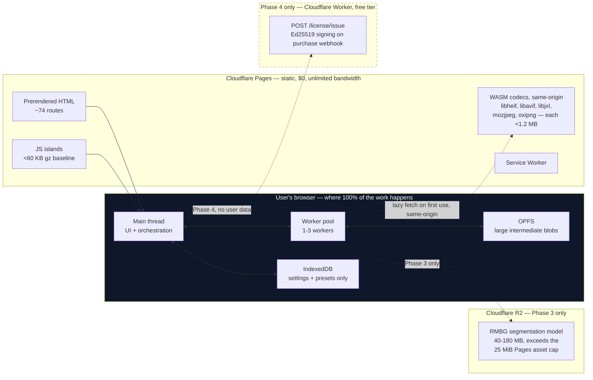
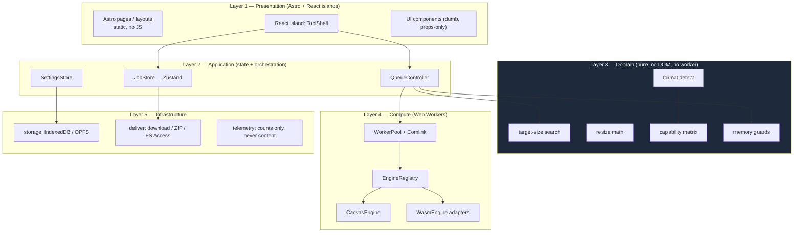
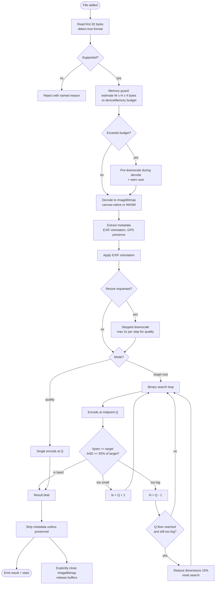

# 04 — System Architecture

**Architecture style:** static-first, layered client monolith with a worker-offloaded compute tier. No backend in v1.

---

## 1. Deployment topology

**The load-bearing property:** no arrow carries a user's image anywhere. The only outbound requests are for static assets (HTML/JS/WASM), and those happen once and are then cached by the service worker.

**Asset-origin policy (this is what makes the privacy test assertable):** every v1.0 asset, including all WASM codecs, is bundled by the build and served **same-origin** from Cloudflare Pages. Each codec is under the 25 MiB Pages asset cap, so nothing needs a third-party CDN. The *only* sanctioned cross-origin fetches, ever, are (a) the Phase-3 segmentation model from our own R2 bucket, and (b) the Cloudflare Web Analytics beacon, which is blocked while any job is in flight. The Milestone 7 privacy test encodes exactly this allowlist.

---

## 2. Layer architecture

**Dependency rule:** dependencies point downward only. Layer 3 (domain) imports nothing from layers 1, 2, 4, or 5 — it is pure TypeScript, fully unit-testable in Node with no browser. This is what makes the target-size algorithm (the wedge feature) provable in CI.

---

## 3. Processing pipeline

**Note on the `EXHAUST` branch:** this is the case most competitors handle badly. A 12 MP photo physically cannot become 20 KB at full resolution. We reduce dimensions and retry rather than returning an oversized file or an unexplained failure — and we tell the user the final dimensions changed.

---

## 4. Worker and concurrency model

| Device class | Detection | Workers | Strategy |
|---|---|---|---|
| Desktop, ≥8 GB | `navigator.deviceMemory >= 8 && hardwareConcurrency >= 8` | 3 | Parallel batch |
| Desktop, 4–8 GB | `deviceMemory >= 4` | 2 | Parallel batch |
| Mobile / low-memory | `deviceMemory < 4` \|\| coarse pointer | **1** | Strictly sequential |

Rules:
- Workers are **long-lived** and reused across jobs; spinning up per job wastes the WASM instantiation cost.
- Communication via **Comlink** over `postMessage`, with `ArrayBuffer`/`ImageBitmap` **transferred, never cloned**. Copying a 50 MB buffer per job is the difference between smooth and janky.
- ⚠️ `SharedArrayBuffer` is **not used** — see ADR-003.
- Each worker instantiates codecs lazily and holds them; a worker that has decoded HEIC keeps libheif warm for the rest of the batch.
- A worker that throws twice consecutively is terminated and replaced (guards against a corrupted WASM instance poisoning the whole batch).

---

## 5. Architecture Decision Records

### ADR-001 — Astro + React islands, not Next.js and not a pure SPA

**Decision:** Astro 5.x with static output, React only inside `client:visible` islands.

**Context.** Google renders JavaScript but queues it, and explicitly still recommends prerendering. More decisively: **GPTBot, OAI-SearchBot, ChatGPT-User, ClaudeBot, Claude-SearchBot, and PerplexityBot do not execute JavaScript at all.** Vercel's crawler analysis found ClaudeBot fetched JS in ~23.84% of requests and never ran it. A client-rendered tool page is a blank page to every AI answer engine — and an increasing share of discovery routes through them.

**Why not Next.js:** SSG works there too, but it ships a much larger hydration baseline and pulls toward a server runtime we explicitly don't want. Astro's island model means the FAQ, spec tables, and instructions on a tool page cost **zero JavaScript**.

**Consequences:** ~74 prerendered routes at build time (exact breakdown in `09-seo-content-plan.md` §2; well under Cloudflare Pages' 20,000-file cap). Tool state does not survive client-side navigation between tool routes — accepted, since each route is a distinct task.

---

### ADR-002 — Cloudflare Pages, not Vercel or Netlify

**Decision:** Cloudflare Pages for hosting. All v1.0 assets same-origin; our own R2 bucket only for the Phase-3 model, which exceeds the 25 MiB per-asset cap.

| Option | Verdict |
|---|---|
| **Cloudflare Pages** | Static asset requests **free and unlimited** on the free plan. 500 builds/mo, 20,000 files/site, **25 MiB max single asset**. Commercial use permitted. |
| Vercel Hobby | ⚠️ **Disqualified.** The Hobby plan is explicitly "non-commercial, personal use only." Any monetization forces Pro at $20/mo. 100 GB transfer cap. |
| Netlify Free | ⚠️ **Not viable.** 300 credits/mo hard cap; bandwidth is 20 credits/GB → **~15 GB/month**, and a production deploy costs 15 credits. For a WASM-heavy site where one cold visit can pull 30 MB, that's ~500 visits/month before the site *pauses*. |

**Consequence:** the 25 MiB per-file cap means the Phase-3 background-removal model must be served from our R2 bucket, never from Pages. All v1.0 WASM codecs are comfortably under the cap and stay same-origin.

---

### ADR-003 — No cross-origin isolation; single-threaded WASM only

**Decision:** do not set `COOP: same-origin` / `COEP: require-corp`. Accept single-threaded WASM everywhere.

**Context.** `SharedArrayBuffer` and threaded WASM require cross-origin isolation, which breaks cross-origin window interactions — OAuth flows, payment popups — and requires every third-party resource to opt in via CORP/CORS, which ad and payment scripts generally don't. `COEP: credentialless` relaxes this but is Chrome-only.

**Decision rationale.** Threading would roughly double ffmpeg.wasm-class throughput, but we aren't doing video. For image codecs, single-threaded WASM is fast enough, and the canvas-native path (ADR-004) bypasses WASM for the common cases entirely. Keeping payment popups and any future ad tag functional is worth more than the throughput.

**Consequence:** every engine must work single-threaded. If video is ever added, it goes through **Mediabunny/WebCodecs** (~5 KB gzipped, hardware-accelerated, no isolation needed) — **not** ffmpeg.wasm multithread.

---

### ADR-004 — Canvas-native encoding first, WASM as fallback and quality tier

**Decision:** try `OffscreenCanvas.convertToBlob({type})` before loading any WASM codec.

**Context.** Modern browsers natively encode JPEG, PNG, WebP, and increasingly AVIF. Each Squoosh-derived WASM codec is 500 KB–1 MB. Loading mozjpeg to make a JPEG when the browser already can is a needless first-load tax on exactly the mobile users most likely to bounce.

**Policy:**

| Operation | Path |
|---|---|
| Decode JPEG/PNG/WebP/GIF/BMP | `createImageBitmap` — native, zero WASM |
| Decode HEIC/HEIF | libheif-wasm — no native path exists |
| Decode AVIF | native if `createImageBitmap` accepts it, else libavif-wasm |
| Decode JXL | libjxl-wasm (revisit once Chrome ships it on-by-default in H2 2026) |
| Encode JPEG/PNG/WebP (default) | canvas |
| Encode JPEG ("best quality" toggle) | mozjpeg-wasm — better quality-per-byte |
| Encode PNG ("optimize" toggle) | oxipng-wasm — lossless size reduction |
| Encode AVIF/JXL | feature-detect canvas, else WASM |

**Consequence:** most users complete a JPEG or WebP conversion having downloaded **zero WASM**. Baseline JS stays under 60 KB gzipped.

---

### ADR-005 — Ephemeral by default; persist settings, never files

**Decision:** user images live in memory (or OPFS for large intermediates) for the session only. IndexedDB stores settings and presets exclusively.

**Context.** Safari with ITP deletes script-created storage for origins with no user interaction in 7 days — IndexedDB and OPFS are *not* exempt. Storage eviction is all-or-nothing per origin.

**Rationale.** Silently persisting people's private photos in a privacy-branded product is both a betrayal and a liability. Ephemeral-by-default is also the honest default given eviction behaviour.

**Consequence:** a reload loses the queue. Mitigate with an explicit "keep files for this session" toggle backed by OPFS, cleared on tab close.

---

### ADR-006 — Domain layer is pure TypeScript with zero browser dependencies

**Decision:** `src/core/` imports no DOM, no worker, no browser API. Browser-dependent code lives in `src/engines/` and `src/platform/` behind interfaces.

**Rationale.** The target-size binary search is the feature the product lives or dies on. Making it a pure function of `(encodeFn, targetBytes, options)` means it is tested exhaustively in Node against a synthetic encoder — hundreds of cases in milliseconds, no browser harness.

**Consequence:** `core` receives an injected `EncodeFn`. Slightly more indirection; total testability.

---

### ADR-007 — Preact via `compat`, not React, as the island runtime

**Decision:** `@astrojs/preact` with `compat: true`. Islands are still authored as React components; only the runtime changes.

**Context.** Measured during Milestone 0 scaffolding, on the real build:

| Runtime | Raw | gzip -9 | brotli |
|---|---|---|---|
| React 19 + react-dom | 190.1 KB | **59.45 KB** | 51.22 KB |
| Preact/compat + hooks + signals + zustand + a hooked component | — | **16.3 KB** | — |

The baseline island JS budget in §7 is **60 KB gz**. React's hydration runtime alone consumes 99% of it *before a single line of our own code*, and Milestone 4 then adds ~20 components plus Comlink and the store on top. The realistic React figure was 85–100 KB against a 60 KB limit — the docs/07 §3 dependency table and the §7 budget could not both be satisfied.

**Why not just raise the budget.** The budget is not arbitrary. The target audience skews mobile and network-constrained (see `01-market-scan.md`), and a conversion that never starts because the bundle is still downloading is a bounce. Preact keeps the budget honest at 27% consumed, leaving ~43.7 KB gz of real headroom for the Milestone 4 island tree.

**Why `compat` rather than authoring in Preact directly.** It keeps the component tree in `08-design-system.md` §3, the file list in `07-folder-structure.md` §1, and the Milestone 4 prompt in `10-build-plan.md` all valid exactly as written. Nothing downstream had to change.

**Consequences.**
- React-19-specific APIs (`use()`, Actions, `useOptimistic`) are unavailable. The tool UI needs none of them; if a future feature does, that is the moment to revisit this ADR rather than to work around it.
- Vite **externalises node_modules during the SSR/prerender pass**, so a dependency that imports React internally resolves through Node and bypasses the alias. `zustand` does exactly this. It is handled by `resolve.alias` plus `ssr.noExternal` in `astro.config.mjs`; **any future React-coupled dependency must be added to `ssr.noExternal` too.**
- `@astrojs/preact` must track Astro's major version — v5 requires Vite 7 and v6 requires Vite 8, while Astro 5 ships Vite 6. Installing `@latest` breaks the build with an unresolved `astro:preact:opts`.

---

## 6. Error taxonomy

Every failure must map to one of these codes and produce a specific, actionable user message. Silent failure is a defect.

| Code | Trigger | User-facing message |
|---|---|---|
| `E_UNSUPPORTED_FORMAT` | Magic bytes match nothing supported | "We can't read {detected} files yet. Supported: …" |
| `E_CORRUPT_FILE` | Decoder throws on valid-looking header | "This file appears to be damaged and couldn't be opened." |
| `E_TOO_LARGE` | Decoded pixels > the device's hard ceiling (`06 §3.4`) | "This image is {W}×{H} — too large for this device's memory. Try resizing first." |
| `E_OOM` | Allocation failure mid-process | "Ran out of memory. Close other tabs, or process fewer files at once." |
| `E_TARGET_UNREACHABLE` | Target size unmet even at min quality + min scale | "Couldn't reach {target} without going below {W}×{H}. Best achieved: {actual}." |
| `E_CODEC_LOAD_FAILED` | WASM fetch/instantiate failed | "Couldn't load the {format} engine. Check your connection and retry." |
| `E_WORKER_CRASHED` | Worker terminated unexpectedly | "Processing stopped unexpectedly. Retrying…" (auto-retry once) |
| `E_ENCODE_FAILED` | Encoder returned null/empty | "Couldn't save as {format}. Try a different output format." |
| `E_PDF_ENCRYPTED` | PDF is password-protected (`isEncrypted`) | "This PDF is password-protected, so it cannot be opened here." |
| `E_PDF_MALFORMED` | PDF parses as a PDF but violates the spec unrecoverably | "This PDF is damaged in a way we can't work around." |

**The two PDF codes are deliberately not `E_CORRUPT_FILE`** (added with the PDF
tools, docs/kepttools/03 §2). `E_CORRUPT_FILE` means "this is not a readable
file". These mean "this IS a readable PDF, and it cannot be operated on" —
either because it is locked, or because it breaks the spec in a way no
workaround covers. Conflating them tells someone to re-download a file that will
fail again in exactly the same way. `E_PDF_ENCRYPTED` is recoverable because the
fix is genuinely in the user's hands: remove the password in whatever opens it.

**Special case — `E_TARGET_UNREACHABLE` is a soft failure.** The domain function never throws (invariant I-5 in `06-contracts.md` §3.1); it returns `targetMet: false` with the closest under-target result. The pipeline then sets **both** `Job.error = { code: 'E_TARGET_UNREACHABLE', recoverable: true, bestEffort: <result> }` **and** `Job.status = 'done'`. The UI renders the file as a usable result with a warning badge and a one-tap "Allow resizing to reach target" action — not as a failed file. This is the one documented exception to the `result` xor `error` rule in `05-data-models.md` §4.

Batch rule: **one file's failure never aborts the batch.** Failed files are flagged inline with a retry affordance; successful results remain downloadable.

---

## 7. Performance budget

| Metric | Budget | Enforcement |
|---|---|---|
| HTML per route | < 25 KB gz | `scripts/check-budgets.mjs` — CI fails over budget |
| Baseline JS (island hydration) | < 60 KB gz | `scripts/check-budgets.mjs` + `rollup-plugin-visualizer` |
| Any single WASM codec | < 1.2 MB | `scripts/check-budgets.mjs` scans `dist/` for `.wasm` |
| LCP on tool route (mobile 4G) | < 2.0 s | Lighthouse CI |
| TBT | < 150 ms | Lighthouse CI (all compute is in workers by construction) |
| Lighthouse, all four categories | ≥ 95, with SEO and A11y at 100 | Lighthouse CI on a 5-route sample |
| Time to first result, 4 MP JPEG, mid laptop | < 3 s (p75) | Benchmark suite in `tests/perf` |
| Memory peak, 12 MP image | < 400 MB **attributable** | `scripts/measure-memory.mjs`; `core/guards` enforces |

**"Attributable"** = process-tree peak during the conversion minus the same
session's at-rest baseline, both reported by `scripts/measure-memory.mjs`
(docs/12 D-103 for why no in-browser counter can see a worker's heap).
The subtraction is the point: the raw process tree carries ~100 MB of
Chromium's own idle footprint, which exists at zero conversions, varies by
Chrome version and machine, and is not something this codebase can spend or
save. The budget governs what the conversion *adds*. Both figures are still
reported, and a strict-peak regression that the attributable number hides
would show up as a baseline shift between runs.

This line was amended in docs/12 D-117 — **after** the D-103 breach was fixed
in code (canvas-per-pass allocation, measured 528 → 430 MB peak), not instead
of fixing it. Amending first would have been weakening the assertion to pass.

`scripts/check-budgets.mjs` must cover **all three** static budgets (HTML, JS, WASM), not just JS.

---

## 8. What changes if a backend is ever added

Reserved for Phase 4+, and strictly limited. The only sanctioned server component is a **single Cloudflare Worker** (free tier: 100k req/day, 10 ms CPU) that signs license keys on a purchase webhook. It must never receive user file data. Its contract is in `06-contracts.md` §4.

If the product ever needs more than that, it stops being this product.
