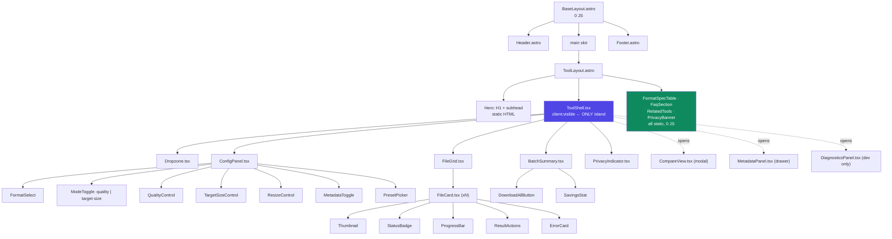

# 08 — Design System & UI Blueprint

For Claude Design and for the React island implementation. Token values are literal — use them verbatim.

---

## 1. Design principles

1. **The dropzone is the product.** On every tool route, the file-drop target is the largest, highest-contrast element above the fold. Configuration is secondary and collapsible.
2. **Zero-config first result.** Every route arrives with sensible defaults derived from its slug. A user who drops files and clicks nothing else must get a correct result.
3. **Privacy is shown, not claimed.** A persistent, quiet indicator ("Processing locally · 0 bytes sent") with a link to a page that tells the user how to verify it themselves in DevTools. Trust badges are worthless; a verifiable claim is not.
4. **Progress is honest.** Show the actual pass number during target-size search, not a fake bar. "Pass 3 of 8 · 112 KB" is more reassuring than a spinner.
5. **Failure is specific.** Every error names the file, the cause, and the next action. Never "Something went wrong."
6. **Dense on desktop, sequential on mobile.** Desktop shows the grid, config, and preview simultaneously. Mobile uses a step flow — the same layout squeezed down is unusable.

---

## 2. Design tokens

### 2.1 Color

Neutral-cool base with a single saturated accent. Accent is reserved for primary action and active state — never decoration.

```css
/* src/styles/tokens.css */
:root {
  /* Neutrals — light */
  --color-bg:            #ffffff;
  --color-bg-subtle:     #f7f8fa;
  --color-bg-muted:      #eef0f4;
  --color-surface:       #ffffff;
  --color-surface-raised:#ffffff;
  --color-border:        #e2e5ea;
  --color-border-strong: #c8cdd6;
  --color-text:          #12161c;
  --color-text-muted:    #5a6472;
  --color-text-subtle:   #838c99;

  /* Accent — indigo */
  --color-accent:        #4f46e5;
  --color-accent-hover:  #4338ca;
  --color-accent-active: #3730a3;
  --color-accent-subtle: #eef2ff;
  --color-accent-text:   #ffffff;

  /* Semantic */
  --color-success:       #0f8a5f;
  --color-success-subtle:#e6f6ef;
  --color-warning:       #b45309;
  --color-warning-subtle:#fef3e2;
  --color-danger:        #c0392f;
  --color-danger-subtle: #fdeeed;
  --color-info:          #1d6fd6;
  --color-info-subtle:   #e8f1fd;

  /* Focus */
  --color-focus-ring:    #4f46e5;
  --focus-ring-width:    2px;
  --focus-ring-offset:   2px;
}

[data-theme="dark"] {
  --color-bg:            #0b0e13;
  --color-bg-subtle:     #12161d;
  --color-bg-muted:      #1a1f28;
  --color-surface:       #12161d;
  --color-surface-raised:#1a1f28;
  --color-border:        #262c37;
  --color-border-strong: #3a4250;
  --color-text:          #eef1f6;
  --color-text-muted:    #a2acbb;
  --color-text-subtle:   #6f7a8a;

  --color-accent:        #8b83f7;
  --color-accent-hover:  #a49df9;
  --color-accent-active: #7a71f0;
  --color-accent-subtle: #1c1b3a;
  --color-accent-text:   #0b0e13;

  --color-success:       #3dd68c;
  --color-success-subtle:#0e2a1e;
  --color-warning:       #f0a94c;
  --color-warning-subtle:#2a1e0c;
  --color-danger:        #f2726a;
  --color-danger-subtle: #2c1312;
  --color-info:          #6aa8f5;
  --color-info-subtle:   #0f1e33;

  --color-focus-ring:    #a49df9;
}
```

**Contrast verification (WCAG 2.2 AA — all pass):**

| Pair | Light | Dark |
|---|---|---|
| text on bg | 16.9:1 | 15.8:1 |
| text-muted on bg | 6.1:1 | 7.4:1 |
| text-muted on bg-subtle | 5.7:1 | 7.9:1 |
| accent-text on accent | 8.6:1 | 11.2:1 |
| accent on bg (link) | 7.4:1 | 7.1:1 |
| danger on bg | 5.9:1 | 6.4:1 |
| **text-subtle on bg** | **3.4:1** ⚠️ | **4.4:1** ⚠️ |
| **text-subtle on bg-subtle** | **3.2:1** ⚠️ | **4.2:1** ⚠️ |
| border on bg (non-text, needs 3:1) | 1.4:1 ⚠️ | 1.6:1 ⚠️ |

⚠️ `--color-border` is decorative only. Any border that *conveys* state (focus, selection, error, or the dropzone outline) must use `--color-border-strong` or a semantic color, both of which clear 3:1.

⚠️ **`--color-text-subtle` must never carry normal-size body text.** It fails the 4.5:1 requirement in §6 against *every* background in *both* themes — measured, not estimated, and caught by `@axe-core/playwright` during Milestone 1. It does clear 3:1, so it remains valid for decorative `aria-hidden` glyphs, non-text UI, and large text (≥ 24px regular or ≥ 18.66px bold, which need only 3:1).

Use `--color-text-muted` for de-emphasised prose — including the dropzone constraints line and the footer legal line, both of which the design handoff originally specified as `text-subtle`. Everything that reads as a third emphasis level is achieved with size and weight, not with a third grey.

### 2.2 Typography

```css
:root {
  --font-sans: ui-sans-serif, system-ui, -apple-system, "Segoe UI", Roboto,
               "Helvetica Neue", Arial, sans-serif;
  --font-mono: ui-monospace, "SF Mono", "Cascadia Mono", Menlo, Consolas, monospace;

  --text-xs:   0.75rem;   --leading-xs:   1.125rem;
  --text-sm:   0.875rem;  --leading-sm:   1.3125rem;
  --text-base: 1rem;      --leading-base: 1.5rem;
  --text-lg:   1.125rem;  --leading-lg:   1.75rem;
  --text-xl:   1.375rem;  --leading-xl:   1.875rem;
  --text-2xl:  1.75rem;   --leading-2xl:  2.125rem;
  --text-3xl:  2.25rem;   --leading-3xl:  2.625rem;
  --text-4xl:  3rem;      --leading-4xl:  3.25rem;

  --weight-normal: 400;  --weight-medium: 500;
  --weight-semibold: 600; --weight-bold: 700;

  --tracking-tight: -0.02em;
  --tracking-normal: 0;
}
```

**No web fonts.** System stack only. A tool site's job is to be instantly usable; a 40 KB font blocking first paint is a self-inflicted wound. This also removes a third-party request from a privacy-branded product.

**Numeric rule:** all file sizes, dimensions, and percentages use `--font-mono` with `font-variant-numeric: tabular-nums`, so digits don't jitter as values update during a search.

### 2.3 Space, radius, shadow, motion

```css
:root {
  --space-1: 0.25rem;  --space-2: 0.5rem;   --space-3: 0.75rem;
  --space-4: 1rem;     --space-5: 1.5rem;   --space-6: 2rem;
  --space-7: 3rem;     --space-8: 4rem;     --space-9: 6rem;

  --radius-sm: 4px;  --radius-md: 8px;  --radius-lg: 12px;
  --radius-xl: 16px; --radius-full: 9999px;

  --shadow-sm: 0 1px 2px rgb(16 22 28 / 0.06);
  --shadow-md: 0 2px 8px rgb(16 22 28 / 0.08), 0 1px 2px rgb(16 22 28 / 0.04);
  --shadow-lg: 0 8px 24px rgb(16 22 28 / 0.12), 0 2px 6px rgb(16 22 28 / 0.06);

  --duration-fast: 120ms;
  --duration-base: 200ms;
  --duration-slow: 320ms;
  --ease-out: cubic-bezier(0.16, 1, 0.3, 1);

  --container-sm: 40rem; --container-md: 56rem;
  --container-lg: 72rem; --container-xl: 84rem;
}

@media (prefers-reduced-motion: reduce) {
  *, *::before, *::after {
    animation-duration: 0.01ms !important;
    transition-duration: 0.01ms !important;
  }
}
```

Breakpoints: `sm 640` · `md 768` · `lg 1024` · `xl 1280`. The desktop three-pane layout activates at `lg`.

---

## 3. Component tree



**Critical structural rule:** `ToolShell` is the *only* `client:visible` component. Everything green in the diagram — the FAQ, spec table, related tools — is static Astro markup that ships zero JavaScript and is fully present in the HTML that AI crawlers and Googlebot receive without rendering.

---

## 4. Wireframes

### 4.1 Tool route, desktop (`lg` and up) — idle

```
┌──────────────────────────────────────────────────────────────────────────┐
│  NoUpload          Convert  Compress  Resize  Metadata      [☀/☾]        │
├──────────────────────────────────────────────────────────────────────────┤
│                                                                          │
│   Convert HEIC to JPG                                          ← h1      │
│   Free, unlimited, and 100% in your browser. Your photos are never       │
│   uploaded.                                                    ← lede    │
│                                                                          │
│  ┌────────────────────────────────────────────────────────────────────┐  │
│  │                                                                    │  │
│  │                          ⇪                                         │  │
│  │              Drop HEIC files here                                  │  │
│  │        or click to browse · or paste from clipboard                │  │
│  │                                                                    │  │
│  │        No file size limit · No sign-up · No upload                  │  │
│  │                                                                    │  │
│  └────────────────────────────────────────────────────────────────────┘  │
│     ↑ dashed 2px --color-border-strong; --color-accent + subtle fill      │
│       on dragover; min-height 280px                                      │
│                                                                          │
│  🔒 Processing locally · 0 bytes sent          How to verify this →      │
│                                                                          │
├──────────────────────────────────────────────────────────────────────────┤
│  What is a HEIC file?                                    ← static, 0 JS  │
│  … 120 words genuinely specific to HEIC …                                │
│                                                                          │
│  ┌─ Format comparison ────────────────────────────────────────────────┐  │
│  │           │ HEIC              │ JPG                                │  │
│  │ Compression│ HEVC, ~50% smaller│ DCT, universal                    │  │
│  │ Support   │ Apple, Win 10+ w/ codec │ Everything since 1992        │  │
│  │ Alpha     │ Yes               │ No                                 │  │
│  │ Metadata  │ Full EXIF + depth │ EXIF                               │  │
│  └────────────────────────────────────────────────────────────────────┘  │
│                                                                          │
│  FAQ  ▸ Does converting lose quality?                                    │
│       ▸ Will my location data be removed?                                │
│       ▸ Can I convert many photos at once?                               │
│       ▸ Why won't Windows open my HEIC files?                            │
│                                                                          │
│  Related: HEIC→PNG · HEIC→WebP · Compress JPG to 100KB                   │
└──────────────────────────────────────────────────────────────────────────┘
```

### 4.2 Desktop — files loaded, three-pane

```
┌──────────────────────────────────────────────────────────────────────────┐
│  NoUpload                                                     [☀/☾]      │
├──────────────┬───────────────────────────────────────┬───────────────────┤
│ SETTINGS     │  FILES (12)              [+ Add more] │  PREVIEW          │
│              │                                       │                   │
│ Output       │  ┌─────────┐ ┌─────────┐ ┌─────────┐ │  ┌─────────────┐  │
│ [JPG      ▾] │  │ [thumb] │ │ [thumb] │ │ [thumb] │ │  │             │  │
│              │  │IMG_01   │ │IMG_02   │ │IMG_03   │ │  │  original   │  │
│ Mode         │  │4.2MB→98K│ │3.8MB→97K│ │▓▓▓░ 62% │ │  │      ╎      │  │
│ (•) Target   │  │ ✓ 76%↓  │ │ ✓ 74%↓  │ │ pass 4/8│ │  │   output    │  │
│ ( ) Quality  │  └─────────┘ └─────────┘ └─────────┘ │  │             │  │
│              │                                       │  └─────────────┘  │
│ Target size  │  ┌─────────┐ ┌─────────┐ ┌─────────┐ │   ◀ drag divider  │
│ [100] [KB ▾] │  │ [thumb] │ │ [thumb] │ │ [thumb] │ │                   │
│ 20 50 100    │  │IMG_04   │ │IMG_05   │ │IMG_06   │ │  4.2 MB → 98 KB   │
│ 200 500 1MB  │  │ queued  │ │ queued  │ │ ⚠ too   │ │  Quality 71       │
│              │  └─────────┘ └─────────┘ │  large  │ │  3024×4032 (kept) │
│ Resize       │                          └─────────┘ │  8 passes         │
│ [None     ▾] │                                       │                   │
│              │                             ⋮ scroll  │  [Compare full ⤢] │
│ Metadata     │                                       │                   │
│ [✓] Strip    ├───────────────────────────────────────┴───────────────────┤
│     EXIF/GPS │  10 done · 1 running · 1 failed                           │
│ [✓] Keep     │  46.1 MB → 1.1 MB   saved 97.6%                           │
│     rotation │                          [Clear]  [Download all (ZIP)]     │
│              │                                                            │
│ ⚙ Advanced ▸ │  🔒 Processing locally · 0 bytes sent                      │
└──────────────┴────────────────────────────────────────────────────────────┘
```

### 4.3 Mobile (`< md`) — step flow

```
┌───────────────────────┐   ┌───────────────────────┐   ┌───────────────────────┐
│ NoUpload        [☰]   │   │ ← Settings            │   │ ← Results             │
├───────────────────────┤   ├───────────────────────┤   ├───────────────────────┤
│ Convert HEIC to JPG   │   │ Output                │   │ ✓ 12 files done       │
│                       │   │ [JPG            ▾]    │   │ 46.1 MB → 1.1 MB      │
│ ┌───────────────────┐ │   │                       │   │ saved 97.6%           │
│ │        ⇪          │ │   │ Mode                  │   │                       │
│ │  Tap to choose    │ │   │ (•) Target size       │   │ ┌────┐┌────┐┌────┐   │
│ │      photos       │ │   │ ( ) Quality           │   │ │ ✓  ││ ✓  ││ ✓  │   │
│ │                   │ │   │                       │   │ │98K ││97K ││99K │   │
│ │ No limit·No upload│ │   │ Target                │   │ └────┘└────┘└────┘   │
│ └───────────────────┘ │   │ [100    ] [KB ▾]      │   │ ┌────┐┌────┐┌────┐   │
│                       │   │ ┌──┬──┬───┬───┐       │   │ │ ✓  ││ ⚠  ││ ✓  │   │
│ 🔒 Local · 0 bytes    │   │ │20│50│100│200│  ← 6   │   │ └────┘└────┘└────┘   │
│                       │   │ ├──┼──┼───┴───┘  chips │   │                       │
│                       │   │ │500│1MB│              │   │                       │
│                       │   │ └───┴───┘              │   │                       │
│ ─────────────────────  │   │                       │   │       ⋮ scroll       │
│ What is a HEIC file?  │   │ Resize   [None    ▾]  │   │                       │
│ …                     │   │ [✓] Strip EXIF & GPS  │   ├───────────────────────┤
│                       │   │                       │   │ [ Download all ZIP ]  │
│ FAQ ▸                 │   ├───────────────────────┤   │ [ Start over ]        │
└───────────────────────┘   │ [   Convert 12 →   ]  │   └───────────────────────┘
                            └───────────────────────┘
   step 1: choose            step 2: configure          step 3: results
   (sticky CTA at bottom, always thumb-reachable)
```

---

## 5. Component specifications

### Dropzone
- States: `idle` · `dragover` · `loading` · `hasFiles` · `error`
- `dragover`: border → `--color-accent`, background → `--color-accent-subtle`, scale 1.005, 120 ms
- Accepts drop, click-to-browse, clipboard paste, and folder drop (`webkitGetAsEntry`)
- Keyboard: focusable, Enter/Space opens the picker
- A11y: `role="button"`, `aria-label="Choose images to convert"`, `aria-describedby` on the constraints line
- Once files exist it collapses to a slim "+ Add more" bar

### TargetSizeControl
- Numeric input + unit select (KB/MB) + six preset chips
- Live validation: below 5 KB shows a warning that quality will suffer badly
- After processing, shows achieved vs. target inline: `98 KB / 100 KB ✓`
- On `E_TARGET_UNREACHABLE`, shows the best achievable and offers "Allow resizing to reach target" as a one-tap fix

### FileCard
| State | Visual |
|---|---|
| `queued` | Dimmed thumb, "Queued" |
| `processing` | Progress bar + `pass 4/8 · 112 KB` in mono |
| `done` | Green check, `4.2 MB → 98 KB`, `76% ↓`, hover reveals Download / Compare / Remove |
| `failed` | Amber/red border, error message, Retry button, Remove |

Fixed dimensions in every state — cards must not reflow as jobs complete, or the grid jumps under the user's cursor.

### PrivacyIndicator
- Persistent, low-emphasis footer strip: `🔒 Processing locally · 0 bytes sent`
- Links to `/how-it-works`, which explains verifying via the DevTools Network tab
- During processing, appends a live counter: `· 7 of 12 processed on this device`
- Deliberately understated. A large trust badge reads as marketing; a quiet factual line reads as true.

### ProgressBar
- Determinate when passes are known; indeterminate only during codec download
- `aria-valuenow`/`aria-valuemin`/`aria-valuemax` maintained
- Batch progress announced via `aria-live="polite"` at start, 50%, and completion only — announcing every file would flood a screen reader

---

## 6. Accessibility requirements (WCAG 2.2 AA)

| Requirement | Implementation |
|---|---|
| Keyboard operability | Full flow — add files, configure, process, download — without a mouse |
| Focus visible | 2px `--color-focus-ring`, 2px offset, never removed |
| Target size (2.5.8) | All interactive targets ≥ 24×24 CSS px; ≥ 44×44 on mobile |
| Status messages (4.1.3) | `aria-live="polite"` region for job status; `assertive` only for errors |
| Contrast | Text ≥ 4.5:1, UI components and state borders ≥ 3:1 — see §2.1 |
| Reduced motion | All transitions collapse under `prefers-reduced-motion` |
| Error identification | Errors in text, never colour alone; icon + text + suggested action |
| Language | `lang` on `<html>`, ready for i18n |
| Skip link | "Skip to tool" as the first focusable element |
| Drag alternative (2.5.7) | Everything achievable by drag is achievable by click/keyboard |

Automated gate: `@axe-core/playwright` on every route in CI, zero violations, plus one manual VoiceOver and one NVDA pass before launch.

---

## 7. Claude Design prompt

```
Design 5 screens for NoUpload, a browser-based image converter where all
processing happens on the user's device (nothing is uploaded).

Screens:
1. /convert/heic-to-jpg — idle, desktop 1440px
2. Same route — 12 files loaded, three-pane working state
3. Compress-to-target-size — mobile 390px, all three steps
4. Results state with one failed file
5. Compare view modal (original vs output, draggable divider)

Use the exact token values in docs/08-design-system.md §2 — colors,
type scale, spacing, radii. Deliver light and dark for screens 1 and 2.

Tone: precise, calm, engineering-credible. Closer to Linear or Vercel than
to a consumer photo app. The dropzone is the largest element on screen.
Privacy is communicated by one quiet factual line, never a badge or shield
graphic. All numeric values in a monospaced, tabular-figure font.
```
